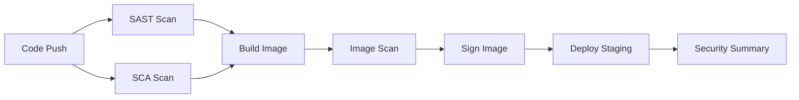

# Threat Intelligence Ingestion Platform - SecDevOps POC

A production-ready, security-hardened threat intelligence ingestion platform demonstrating modern SecDevOps practices including secure containerization, Infrastructure as Code, automated security scanning, and threat-centric observability.

## Table of Contents

- [Overview](#overview)
- [Architecture](#architecture)
- [Security Features](#security-features)
- [Prerequisites](#prerequisites)
- [Quick Start](#quick-start)
- [Detailed Setup](#detailed-setup)
- [CI/CD Pipeline](#cicd-pipeline)
- [Observability](#observability)
- [Security Scanning](#security-scanning)
- [Image Signing Strategy](#image-signing-strategy)
- [Troubleshooting](#troubleshooting)

---

## Overview

This POC implements a **threat intelligence worker** that:
- Fetches threat indicators from public feeds (URLhaus, ThreatFox)
- Processes and stores indicators in Redis
- Exposes Prometheus metrics for observability
- Runs in a hardened Kubernetes environment with network isolation

### Key Components

1. **Python Worker** (`app/worker.py`)
   - Fetches from Abuse.ch URLhaus and ThreatFox feeds
   - Stores indicators in Redis with TTL
   - Exposes `/metrics` and `/health` endpoints

2. **Infrastructure** (Terraform)
   - Kubernetes namespace: `intel-ingestion`
   - Redis deployment (task queue)
   - Kubernetes Secrets (API keys)
   - NetworkPolicy (zero-trust networking)

3. **CI/CD Pipeline** (GitHub Actions)
   - SAST scanning (Bandit)
   - SCA scanning (Trivy, Safety)
   - Secret detection
   - Container image scanning
   - Image signing strategy (Cosign)
   - Automated deployment

---

## Architecture

```
┌─────────────────────────────────────────────────────────────┐
│                     Kubernetes Cluster                       │
│                      (Minikube/Local)                        │
│                                                              │
│  ┌────────────────────────────────────────────────────┐    │
│  │         Namespace: intel-ingestion                  │    │
│  │                                                      │    │
│  │  ┌──────────────┐         ┌─────────────┐          │    │
│  │  │              │ Redis   │             │          │    │
│  │  │ Intel Worker │────────▶│    Redis    │          │    │
│  │  │   (Python)   │  Queue  │   (Cache)   │          │    │
│  │  │              │         │             │          │    │
│  │  └──────┬───────┘         └─────────────┘          │    │
│  │         │                                            │    │
│  │         │ External HTTPS (via NetworkPolicy)        │    │
│  │         │                                            │    │
│  └─────────┼────────────────────────────────────────────┘    │
│            │                                                 │
└────────────┼─────────────────────────────────────────────────┘
             │
             ▼
    ┌────────────────┐
    │ Threat Feeds:  │
    │ - URLhaus      │
    │ - ThreatFox    │
    └────────────────┘
```

---

## Security Features

### 1. Secure Containerization ✅

- **Multi-stage Dockerfile** reduces attack surface
- **Minimal base image**: `python:3.11-slim`
- **Non-root user** (UID 1000)
- **Read-only root filesystem**
- **No secrets baked in** - injected via Kubernetes Secrets
- **Dropped ALL capabilities**
- **Health checks** for reliability

### 2. Infrastructure as Code ✅

- **Terraform** for declarative infrastructure
- **Kubernetes Namespace** isolation
- **NetworkPolicy** for zero-trust networking:
  - Worker → Redis only
  - Worker → External HTTPS only
  - No unrestricted egress
- **Resource limits** to prevent resource exhaustion
- **Security contexts** on pod and container level

### 3. SecDevOps Pipeline ✅

GitHub Actions workflow (`.github/workflows/security-pipeline.yaml`):

| Stage | Tool | Purpose |
|-------|------|---------|
| SAST | Bandit | Python security linting |
| Secret Detection | grep + regex | Find hardcoded secrets |
| SCA | Safety | Vulnerable dependency scanning |
| SCA | Trivy (filesystem) | Dependency vulnerabilities |
| Image Scan | Trivy (image) | Container image CVE scanning |
| Image Signing | Cosign/Sigstore | Image provenance & verification |
| Deploy | kubectl | Automated staging deployment |

### 4. Threat-Centric Observability ✅

**Metrics Exposed** (`/metrics` endpoint):

```prometheus
# Total indicators processed by source and type
threat_indicators_processed_total{source="urlhaus",type="malicious_url"} 1524

# External API errors by source and error type
external_api_errors_count{source="threatfox",error_type="request_failed"} 3

# Last successful feed fetch timestamp
threat_feed_last_success_timestamp{source="urlhaus"} 1648392847
```

**Prometheus Alert Rules** (`docs/prometheus-alerts.yaml`):
- `ThreatFeedSourceDown` - Feed unavailable/high error rate
- `NoThreatIndicatorsProcessed` - Worker stalled
- `StaleThreatFeedData` - Data freshness issues
- `RedisConnectionErrors` - Infrastructure issues

---

## Prerequisites

### Required Tools

- **Docker** (v20.10+)
- **Minikube** (v1.30+)
- **Terraform** (v1.0+)
- **kubectl** (v1.27+)
- **Python 3.11** (for local development)
- **make** (optional, for convenience)

### Install Minikube

```bash
# Linux
curl -LO https://storage.googleapis.com/minikube/releases/latest/minikube-linux-amd64
sudo install minikube-linux-amd64 /usr/local/bin/minikube

# macOS
brew install minikube
```

### Install Terraform

```bash
# Linux
wget https://releases.hashicorp.com/terraform/1.6.0/terraform_1.6.0_linux_amd64.zip
unzip terraform_1.6.0_linux_amd64.zip
sudo mv terraform /usr/local/bin/

# macOS
brew install terraform
```

---

## Quick Start

### Option 1: Using Makefile (Recommended)

```bash
# 1. Start minikube


# 2. Configure Docker to use minikube's daemon
eval $(minikube docker-env)

# 3. Full deployment (build + terraform + k8s)
make deploy

# 4. Check status
make status

# 5. View logs
make logs

# 6. Access metrics
make metrics
# Visit: http://localhost:8000/metrics
```

### Option 2: Manual Steps

```bash
# 1. Start minikube
minikube start --cpus=2 --memory=4096

# 2. Configure Docker environment
eval $(minikube docker-env)

# 3. Build Docker image
docker build -t intel-worker:latest .

# 4. Deploy infrastructure with Terraform
cd terraform
terraform init
terraform apply -auto-approve
cd ..

# 5. Deploy application
kubectl apply -f k8s/

# 6. Verify deployment
kubectl get pods -n intel-ingestion
kubectl logs -n intel-ingestion -l app=intel-worker -f
```

---

## Detailed Setup

### Step 1: Build Container Image

```bash
# Build multi-stage Dockerfile
docker build -t intel-worker:latest .

# Verify image
docker images | grep intel-worker

# Inspect security (run as non-root)
docker run --rm intel-worker:latest id
# Should show: uid=1000(appuser) gid=1000(appuser)
```

### Step 2: Provision Infrastructure

```bash
cd terraform

# Initialize Terraform
terraform init

# Preview changes
terraform plan

# Apply infrastructure
terraform apply

# View outputs
terraform output
```

**What gets created:**
- Namespace: `intel-ingestion`
- Redis deployment + service
- Kubernetes Secret: `threat-feed-secrets`
- ConfigMap: `worker-config`
- NetworkPolicy: `worker-network-policy`

### Step 3: Deploy Application

```bash
# Apply Kubernetes manifests
kubectl apply -f k8s/deployment.yaml
kubectl apply -f k8s/service.yaml

# Optional: ServiceMonitor for Prometheus Operator
kubectl apply -f k8s/servicemonitor.yaml
```

### Step 4: Verify Deployment

```bash
# Check pods
kubectl get pods -n intel-ingestion

# Expected output:
# NAME                            READY   STATUS    RESTARTS   AGE
# intel-worker-xxxxxxxxxx-xxxxx   1/1     Running   0          2m
# redis-xxxxxxxxxx-xxxxx          1/1     Running   0          5m

# Check logs
kubectl logs -n intel-ingestion -l app=intel-worker --tail=50

# Port-forward to metrics
kubectl port-forward -n intel-ingestion svc/intel-worker 8000:8000

# Access metrics
curl http://localhost:8000/metrics
curl http://localhost:8000/health
```

---

## CI/CD Pipeline

### GitHub Actions Workflow

Located at `.github/workflows/security-pipeline.yaml`

**Triggered on:**
- Push to `main` or `develop` branches
- Pull requests to `main`
- Manual workflow dispatch

**Pipeline Stages:**



### Running Locally

```bash
# Install scanning tools
pip install bandit safety

# SAST scan
make scan-code

# Dependency scan
make scan-deps

# Image scan (requires Trivy)
make scan-image

# All scans
make scan-all
```

### Security Scan Results

The pipeline will **fail** if:
- Hardcoded secrets detected
- CRITICAL/HIGH vulnerabilities in dependencies
- CRITICAL vulnerabilities in container image
- Security policy violations

---

## Observability

### Metrics Endpoint

```bash
# Port-forward to worker
kubectl port-forward -n intel-ingestion svc/intel-worker 8000:8000

# Scrape metrics
curl http://localhost:8000/metrics
```

**Key Metrics:**

```prometheus
# HELP threat_indicators_processed_total Total number of threat indicators processed
# TYPE threat_indicators_processed_total counter
threat_indicators_processed_total{source="urlhaus",type="malicious_url"} 1524.0
threat_indicators_processed_total{source="threatfox",type="malicious_host"} 892.0

# HELP external_api_errors_count Number of external API errors
# TYPE external_api_errors_count counter
external_api_errors_count{error_type="request_failed",source="urlhaus"} 2.0

# HELP threat_feed_last_success_timestamp Last successful feed fetch timestamp
# TYPE threat_feed_last_success_timestamp gauge
threat_feed_last_success_timestamp{source="urlhaus"} 1.709409247e+09
```

### Prometheus + Grafana (Optional)

```bash
# Install Prometheus Operator
kubectl create namespace monitoring
helm repo add prometheus-community https://prometheus-community.github.io/helm-charts
helm install prometheus prometheus-community/kube-prometheus-stack -n monitoring

# Apply alert rules
kubectl apply -f docs/prometheus-alerts.yaml

# Access Prometheus
kubectl port-forward -n monitoring svc/prometheus-kube-prometheus-prometheus 9090:9090

# Access Grafana (default: admin/prom-operator)
kubectl port-forward -n monitoring svc/prometheus-grafana 3000:80
```

### Alert Rules

Located in `docs/prometheus-alerts.yaml`

**Critical Alerts:**
1. **ThreatFeedSourceDown** - Feed error rate > 10% for 5 minutes
2. **ThreatIntelWorkerDown** - No worker pods available
3. **RedisConnectionErrors** - Cannot connect to Redis

**Warning Alerts:**
1. **NoThreatIndicatorsProcessed** - No indicators for 10 minutes
2. **StaleThreatFeedData** - Feed not updated in 15 minutes
3. **LowIndicatorProcessingRate** - Below baseline processing

---

## Security Scanning

### SAST (Bandit)

```bash
# Run Bandit security scanner
bandit -r app/ -f txt

# Generate JSON report
bandit -r app/ -f json -o bandit-report.json
```

### SCA (Trivy)

```bash
# Scan filesystem for vulnerabilities
docker run --rm -v $(pwd):/src aquasec/trivy:latest fs /src/app

# Scan container image
docker run --rm -v /var/run/docker.sock:/var/run/docker.sock \
  aquasec/trivy:latest image intel-worker:latest
```

### Secret Detection

```bash
# Check for hardcoded secrets
grep -r -E "(password|api_key|secret|token)\s*=\s*['\"][^'\"]{8,}" app/ || echo "No secrets found"
```

---

## Image Signing Strategy

### Using Sigstore Cosign

**Keyless Signing (Recommended for CI/CD):**

```bash
# Install Cosign
go install github.com/sigstore/cosign/v2/cmd/cosign@latest

# Sign image (uses OIDC identity)
cosign sign --yes intel-worker:latest

# Verify signature
cosign verify \
  --certificate-identity-regexp='.*@example\.com' \
  --certificate-oidc-issuer='https://token.actions.githubusercontent.com' \
  intel-worker:latest
```

**Key-based Signing:**

```bash
# Generate key pair
cosign generate-key-pair

# Sign with private key
cosign sign --key cosign.key intel-worker:latest

# Verify with public key
cosign verify --key cosign.pub intel-worker:latest
```

### Admission Control

**Policy Enforcement with Kyverno:**

```yaml
apiVersion: kyverno.io/v1
kind: ClusterPolicy
metadata:
  name: verify-image-signature
spec:
  validationFailureAction: enforce
  rules:
  - name: verify-signature
    match:
      resources:
        kinds:
        - Pod
    verifyImages:
    - imageReferences:
      - "ghcr.io/your-org/intel-worker:*"
      attestors:
      - count: 1
        entries:
        - keyless:
            subject: "*@your-domain.com"
            issuer: "https://token.actions.githubusercontent.com"
```

---

## Troubleshooting

### Pod Not Starting

```bash
# Check pod status
kubectl describe pod -n intel-ingestion -l app=intel-worker

# Check events
kubectl get events -n intel-ingestion --sort-by='.lastTimestamp'

# Check logs
kubectl logs -n intel-ingestion -l app=intel-worker --previous
```

### Redis Connection Errors

```bash
# Test Redis connectivity
kubectl exec -it -n intel-ingestion deploy/redis -- redis-cli ping
# Should return: PONG

# Check NetworkPolicy
kubectl describe networkpolicy -n intel-ingestion worker-network-policy

# Test from worker pod
kubectl exec -it -n intel-ingestion deploy/intel-worker -- \
  python -c "import redis; r=redis.Redis(host='redis'); print(r.ping())"
```

### No Metrics Available

```bash
# Check if metrics port is exposed
kubectl get svc -n intel-ingestion intel-worker

# Port-forward and test
kubectl port-forward -n intel-ingestion svc/intel-worker 8000:8000
curl http://localhost:8000/metrics
curl http://localhost:8000/health
```

### Image Pull Errors in Minikube

```bash
# Ensure using minikube's Docker daemon
eval $(minikube docker-env)

# Rebuild image
docker build -t intel-worker:latest .

# Set imagePullPolicy to IfNotPresent
kubectl set image deployment/intel-worker worker=intel-worker:latest -n intel-ingestion
kubectl patch deployment intel-worker -n intel-ingestion -p '{"spec":{"template":{"spec":{"containers":[{"name":"worker","imagePullPolicy":"IfNotPresent"}]}}}}'
```

### Terraform State Issues

```bash
# Refresh state
cd terraform
terraform refresh

# Import existing resources
terraform import kubernetes_namespace.intel_ingestion intel-ingestion

# Destroy and recreate
terraform destroy -auto-approve
terraform apply -auto-approve
```

---

## Project Structure

```
intel-ingestion/
├── app/
│   ├── worker.py              # Main Python worker application
│   └── requirements.txt       # Python dependencies
├── terraform/
│   ├── providers.tf           # Terraform provider config
│   ├── main.tf                # Main infrastructure code
│   ├── variables.tf           # Input variables
│   └── outputs.tf             # Output values
├── k8s/
│   ├── deployment.yaml        # Worker deployment manifest
│   ├── service.yaml           # Service for metrics endpoint
│   └── servicemonitor.yaml    # Prometheus ServiceMonitor
├── .github/
│   └── workflows/
│       └── security-pipeline.yaml  # CI/CD pipeline
├── docs/
│   └── prometheus-alerts.yaml # Alert rules for Prometheus
├── Dockerfile                 # Multi-stage container build
├── Makefile                   # Convenience commands
├── .dockerignore             # Docker build exclusions
├── .gitignore                # Git exclusions
└── README.md                 # This file
```

---

## Next Steps

### Production Readiness

1. **High Availability**
   - Multi-replica worker deployment
   - Redis Sentinel or cluster mode
   - Pod Disruption Budgets

2. **Security Enhancements**
   - Pod Security Admission
   - OPA/Kyverno policy enforcement
   - Image signing verification
   - Secrets from external vault (HashiCorp Vault, AWS Secrets Manager)

3. **Observability**
   - Full Prometheus + Grafana stack
   - Distributed tracing (Jaeger/Tempo)
   - Log aggregation (Loki, ELK)
   - SLO/SLI definition

4. **CI/CD Enhancements**
   - GitOps with ArgoCD/Flux
   - Canary deployments
   - Automated rollback
   - Performance testing

5. **Threat Intelligence**
   - Additional feed sources
   - Indicator enrichment
   - Deduplication logic
   - Export to SIEM/SOAR

---

## Contributing

1. Fork the repository
2. Create a feature branch
3. Make changes with security in mind
4. Run security scans: `make scan-all`
5. Submit pull request

---

## License

MIT License - See LICENSE file for details

---

## Support

For issues and questions:
- GitHub Issues: https://github.com/your-org/intel-ingestion/issues
- Documentation: https://wiki.example.com/intel-ingestion

---

**Built with ❤️ for SecDevOps**
