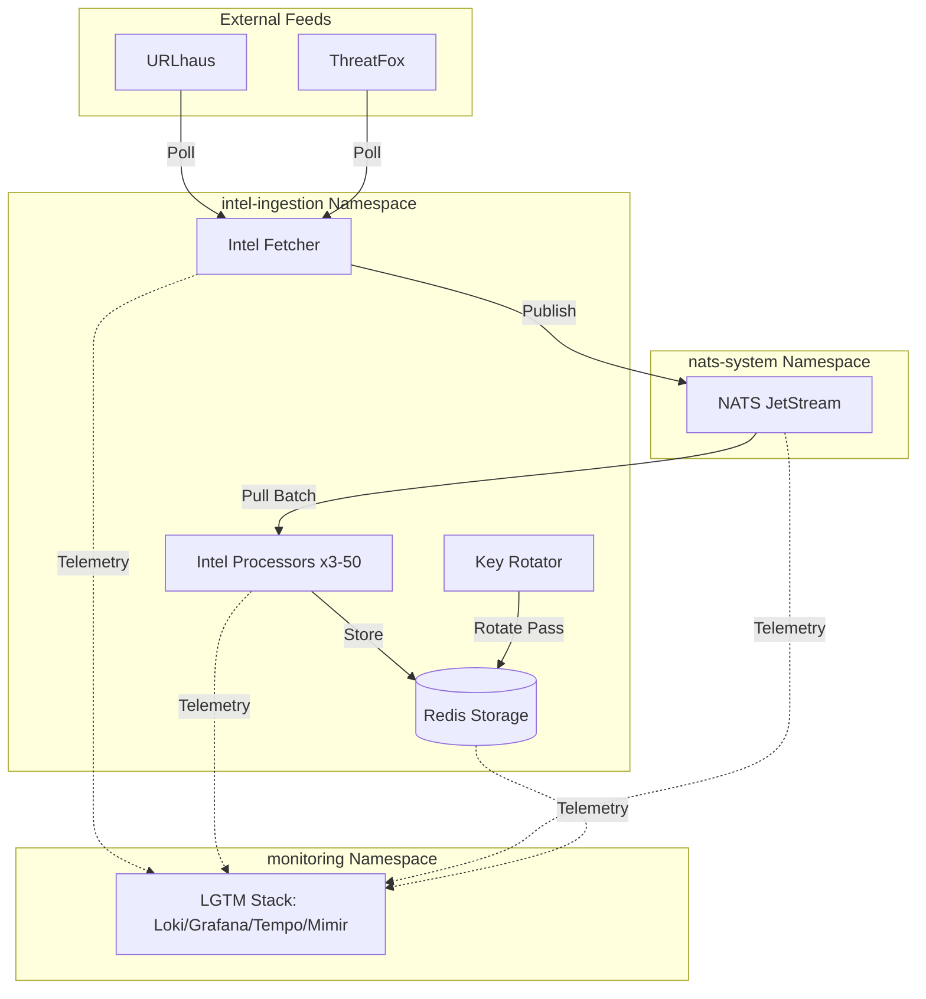

# 🏛️ Threat Intel Pipeline: Systems Architecture & Operations

This document is the "Source of Truth" for the Intel Ingestion project. It describes not just what we built, but **why** we built it this way and **how** it behaves under pressure.

---

## 1. Design Philosophy
We designed this pipeline with three core pillars in mind:
1.  **Resilience:** Decoupled Producers (Fetchers) and Consumers (Processors) using NATS JetStream. If the storage layer slows down, the queue absorbs the impact.
2.  **Defense-in-Depth:** Hardened containers combined with Kyverno admission policies. Security isn't an "add-on"; it's enforced by the cluster.
3.  **Total Visibility:** A "day zero" requirement. Every log, metric, and trace is aggregated into a single Grafana dashboard.

---

## 2. High-Level Architecture

---

## 3. The Journey of an Indicator

### Phase 1: Discovery (Fetcher)
The **Intel Fetcher** (`app/fetcher.py`) acts as our proactive scout.
*   **Schedule:** Runs every 5 minutes (`FETCH_INTERVAL=300`).
*   **Deduplication:** We attach a unique `Nats-Msg-Id` to every message. This allows NATS to recognize and drop duplicate indicators published within a 2-minute window.
*   **Metrics:** It tracks `threat_indicators_published_total` so we know exactly how much data is entering the system.

### Phase 2: The Safety Buffer (NATS JetStream)
Data lands in the `THREAT_INDICATORS` stream.
*   **Persistence:** Unlike standard NATS, our setup uses **File Storage (10Gi PVC)**. Messages survive cluster restarts.
*   **Retention:** We keep data for 24 hours or until the 10GB limit is reached.
*   **Consumer Group:** We use a durable pull consumer (`processor-group`). This ensures that even if all processors go down, the data waits patiently for them to return.

### Phase 3: Processing & Scaling (Processor)
The **Intel Processor** (`app/processor.py`) is the engine of the pipeline.
*   **Scaling:** Managed by a **Horizontal Pod Autoscaler (HPA)**. We scale from 3 to 50 replicas based on CPU (70%) and Memory (80%) targets.
*   **Reliability:** We use **Explicit Acknowledgments**. A processor only tells NATS "I'm done" **after** the data is safely in Redis. If a processor crashes mid-task, NATS redelivers the message to a healthy replica.
*   **Tracing:** Every processing job generates an **OpenTelemetry Trace**. You can see the full lifecycle (Fetch → Parse → Store) in Grafana.

### Phase 4: Storage (Redis)
Final storage for high-speed lookups with a 24-hour TTL.
*   **Key Patterns:** `threat:url:<url>` and `threat:host:<ip/domain>`.
*   **Key Rotation:** A CronJob rotates the Redis password every hour. The application detects the new password on disk and re-authenticates **without a pod restart**.

---

## 4. Security Framework

### Hardened Containers
Every application image follows a "Security-First" Dockerfile pattern:
*   **Distro:** Debian 12 (Bookworm) stable slim images.
*   **Non-Root:** Everything runs as `appuser` (UID 1000).
*   **Minimalism:** Only essential packages are installed; `pip` and `apt` caches are cleared post-build.

### Kyverno Admission Control
We use Kyverno to enforce a "Bunker" policy. Any pod that tries to bypass security (e.g., requesting root, mounting host paths, or adding capabilities) is **blocked at the API level**.

### CI/CD Security Pipeline
Our GitHub Actions workflow runs a "Security Gauntlet" before any code is deployed:
1.  **SAST (Bandit):** Scans for insecure code patterns.
2.  **SCA (Trivy):** Scans every dependency for known CVEs.
3.  **Image Scan:** Scans the final built image for OS-level vulnerabilities.

---

## 5. Observability (The LGTM Stack)
We centralized everything into the `monitoring` namespace:
*   **Loki:** Structured log search. Filter by `{app="intel-processor", level="ERROR"}`.
*   **Mimir:** Scalable metrics. Powering the "Pipeline Throughput" dashboard.
*   **Tempo:** Trace aggregation. Visualizing the latency of every Redis operation.
*   **Grafana:** The "Single Pane of Glass." Combines metrics, logs, and traces into a unified view.

---

## 6. Known Limitations & Roadmap
*   **NATS Replicas:** Currently single-node for the POC. Production should use a 3-node cluster.
*   **PVCs:** Loki and Tempo are currently using `emptyDir` (ephemeral). Persistent storage should be added for production.
*   **Auth:** Grafana is currently in "Anonymous Admin" mode for easier local testing.

---
*Document Version: 1.2 | Last Updated: 2026-04-04*
